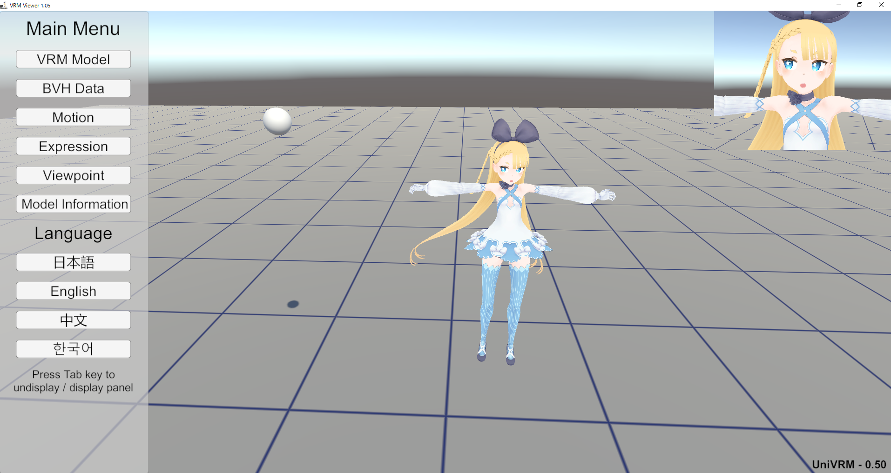

# UniVRMTest

This is a project for [UniVRM](https://github.com/dwango/UniVRM) build test and samples.

これは[UniVRM](https://github.com/dwango/UniVRM)のテストとサンプル集です。

# License

The project is released under the [MIT License](License.txt).

## VRMViewer

An application that users can view VRM models.  

ユーザーがVRMモデル情報を確認できるアプリケーションです。

## Download
###
1. Go to the [releases page](https://github.com/dwango/UniVRMTest/releases)
1. Download the latest version ``VRMViewer-v.1.xx``

###
1. 本リポジトリの[リリースページ](https://github.com/dwango/UniVRMTest/releases)へ移動してください
1. 最新の``VRMViewer-v.1.xx``をダウンロードしてください

## How to load a VRM file
###
1. Run ``VRMViewer.exe``
1. Click the VRM Model button
1. Select a VRM file from your computer

###
1. ``VRMViewer.exe``を実行してください
1. ``VRMモデル``ボタンをクリックしてください
1. パソコンからVRMファイルを選んでください

## ToDo

* [x] モデル情報表示 (Model information)
* [x] コマンドライン引数 (Command line arguments)
* [x] T-Pose・モーションスイッチ (T-Pose / Motion switch)
* [x] 目線・正面・ターゲット・カメラ目線 (The model looks straight ahead / looks at target / looks at camera)
    * [x] VRMLookAtBoneApplyer
    * [x] VRMLookAtBlendShapeApplyer
* [ ] BlendShape
    * [x] AIUEO
    * [x] AutoBlink 
    * [ ] Next, Prev
* [x] 表情リスト (Expression list)
* [x] 一人称表示 (Model rendering in first-person mode)
* [ ] 頂点数 (Vertex count)

